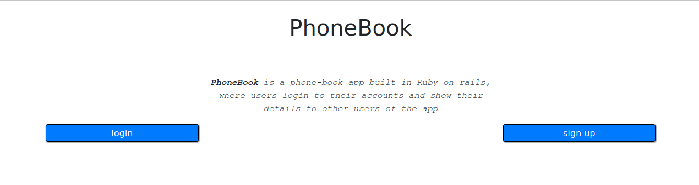
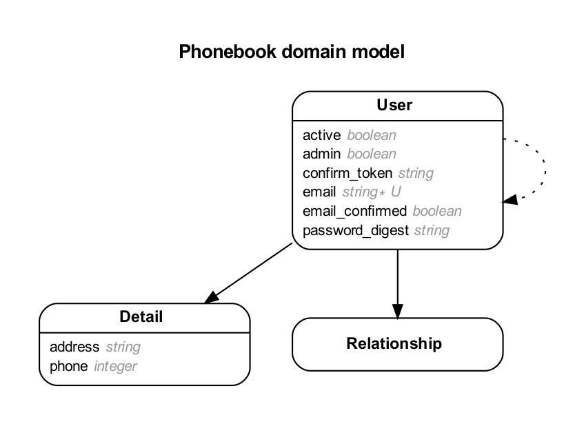
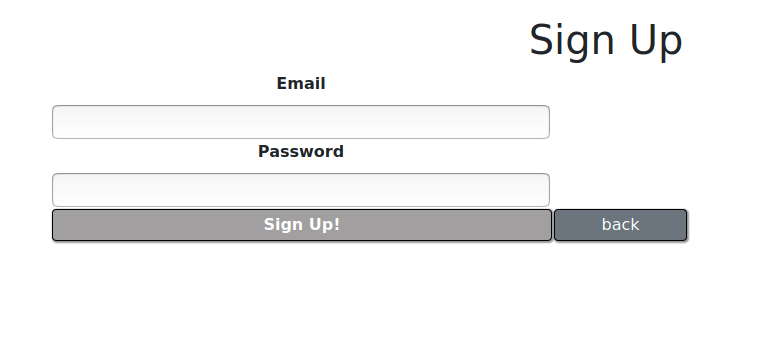
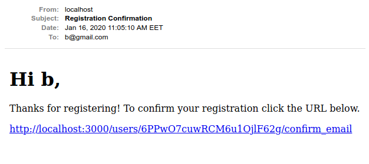
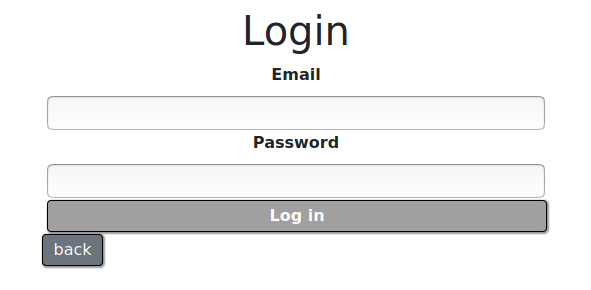
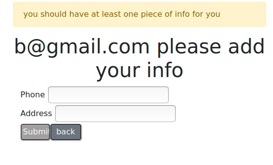
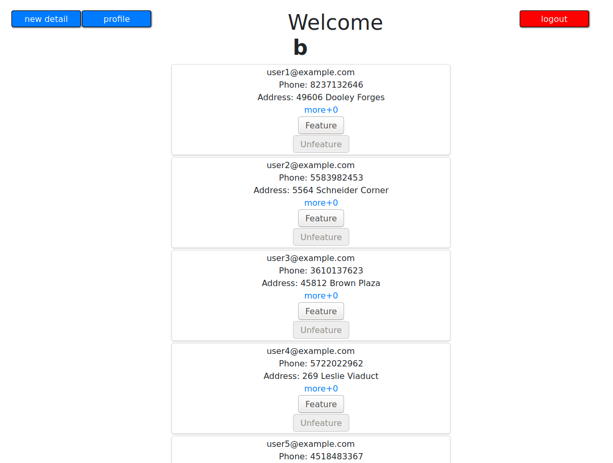
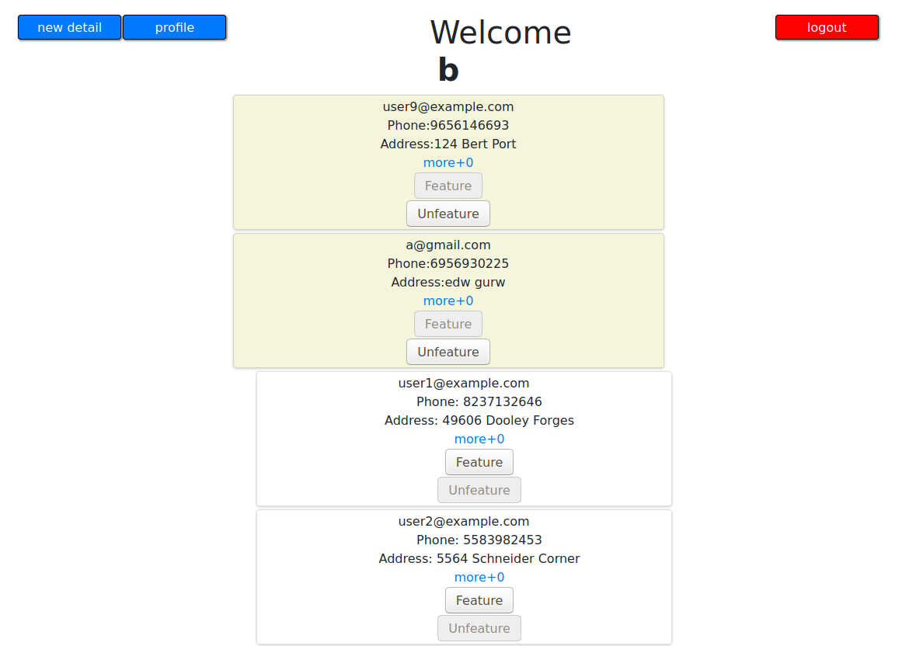
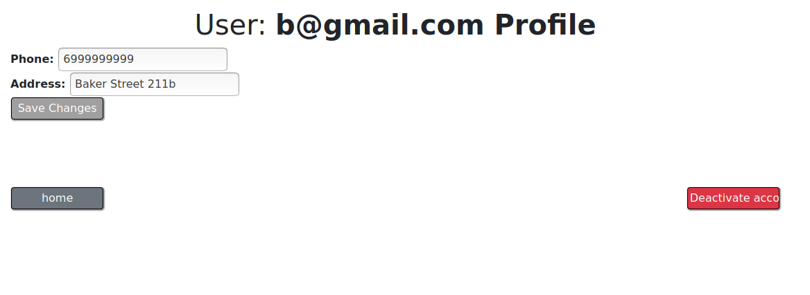
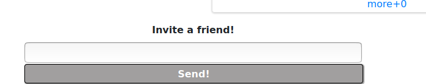

# README

## PhoneBook app

PhoneBook app, is a Ruby on Rails application of a phonebook, where users, create profiles where they add their personal info, adresses and corresponding phone numbers.

* Ruby version
    Ruby version: **Ruby 2.5.1p57** , **Rails 5.2.4.1**
    Bootstrap version **4.4.1**

* App features 
    * User creation
    * Details addition and editing
    * Confirmation emails
    * Invitation emails
    * Users featuring
    * Account deactivation

### Execution 

1. Clone the repo. 

2. Execute `$bundle`.

3. Then `$rails s`.

4. You are good to go.

### Configuration 
`../db/seeds.rb` contains code that is executed when `$rails db:reset` that seeds the db with 25 users and details for each user

### DB schema 

Our Database looks like this 

#### User
The user model has 6 columns, `email:` `password_digest:` `email_confirmed:` `confirm_token:` `active:` `admin:`.
Email and password are the main fields needed to crete a User instance. 
Admin and active take boolean values, giving admin priviledges to a user and declaring the state of the account, respectively. An inactive account (`active: false`) won't appear in a user's feed.

#### Detail
The Detail model stores the basic info for our users. `address:` and `phone:`. A user is oblidged to have at least one detail but is not restricted to only having one. A User `has_many` details, is a relationship **one_to_many** that depends on User's existance.

#### Relationship 
Finaly Relationship is an assisting model to store and create the *featured*. A User `has_many` featured `through:` relationship. Is a has_many_through relationship, that creates a list of featured users for each user.

## Presentation

Add an email and a password and you are done! You know have a PhoneBook app account. Actually after you click on the link of the confirmation email that will be send to you. Now you are done! 

Now that you have an activated account you can add you credentials and login.

Last step of creation is adding you first detail. Its important that you have at least one address-phone pair.

Now that you have logged in you can see all the active members of the PhoneBook app.

If you click on `more+` you can see the details of the corresponding user. 
If someone is very important to you, you can make him a featured friend, having him appearing on top of the page.

At any point you can logout. Or add a new detail.
Clicking on the profile button redirects you to your own profile where you can edit/delete details or activate/deactivate your account.

If you scroll far enough in the starting page, you can see a form where you can send an invitation to a friend that is not a member of the PhoneBook app yet. Clicking `send!` it will send him an email that invites him to our App.

